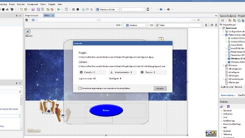

# Spooch

[This page in english.](README.md)

[Spooch](https://spooch.gamolf.fr/) est un jeu vidéo développé sous Delphi dans un projet FireMonkey: parcourrez l'espace en évitant les tirs et vaisseaux enemis.

Les sessions de développement ont été faites en direct sur [Twitch](https://www.twitch.tv/patrickpremartin). Leurs rediffusions sont disponibles sur [la page de Spooch](https://serialstreameur.fr/jv-spooch.php) du site [Serial Streameur](https://serialstreameur.fr/).

Des explications et informations côté code sources sont disponibles sur [la page de Spooch](https://developpeur-pascal.fr/spooch.html) du blog [Developpeur Pascal](https://developpeur-pascal.fr/).

Vous trouverez plus d'informations, des vidéos et les infos de téléchargement de [Spooch](https://spooch.gamolf.fr/) sur [son site web](https://spooch.gamolf.fr/).

Ce dépôt de code contient un projet développé en langage Pascal Objet sous Delphi. Vous ne savez pas ce qu'est Dephi ni où le télécharger ? Vous en saurez plus [sur ce site web](https://delphi-resources.developpeur-pascal.fr/).

## Installation

Pour télécharger ce projet il est recommandé de passer par "git" mais vous pouvez aussi télécharger un ZIP directement depuis [son dépôt GitHub](https://github.com/DeveloppeurPascal/Spooch).

**Attention :** si le projet utilise des dépendances sous forme de sous modules ils seront absents du fichier ZIP. Vous devrez les télécharger à la main.

## Dépendances

Ce dépôt de code dépend des dépôts suivants :

* project 1
* project 2

## Comment demander une nouvelle fonctionnalité, signaler un bogue ou une faille de sécurité ?

Si vous voulez une réponse du propriétaire de ce dépôt la meilleure façon de procéder pour demander une nouvelle fonctionnalité ou signaler une anomalie est d'aller sur [le dépôt de code sur GitHub](https://github.com/DeveloppeurPascal/Spooch) et [d'ouvrir un ticket](https://github.com/DeveloppeurPascal/Spooch/issues).

Si vous avez trouvé une faille de sécurité n'en parlez pas en public avant qu'un correctif n'ait été déployé ou soit disponible. [Contactez l'auteur du dépôt en privé](https://developpeur-pascal.fr/nous-contacter.php) pour expliquer votre trouvaille.

Vous pouvez aussi cloner ce dépôt de code et participer à ses évolutions en soumettant vos modifications si vous le désirez. Lisez les explications dans le fichier [CONTRIBUTING.md](CONTRIBUTING.md).

## Modèle de licence double

Ce projet est distribué sous licence [AGPL 3.0 ou ultérieure] (https://choosealicense.com/licenses/agpl-3.0/).

Si vous voulez l'utiliser en totalité ou en partie dans vos projets mais ne voulez pas en partager les sources ou ne voulez pas distribuer votre projet sous la même licence, vous pouvez acheter le droit de l'utiliser sous la licence [Apache License 2.0](https://choosealicense.com/licenses/apache-2.0/) ou une licence dédiée ([contactez l'auteur](https://developpeur-pascal.fr/nous-contacter.php) pour discuter de vos besoins).

## Supportez ce projet et son auteur

Si vous trouvez ce dépôt de code utile et voulez le montrer, merci de faire une donation [à son auteur](https://github.com/DeveloppeurPascal). Ca aidera à maintenir le projet (codes sources et binaires).

Vous pouvez utiliser l'un de ces services :

* [GitHub Sponsors](https://github.com/sponsors/DeveloppeurPascal)
* [Liberapay](https://liberapay.com/PatrickPremartin)
* [Patreon](https://www.patreon.com/patrickpremartin)
* [Paypal](https://www.paypal.com/paypalme/patrickpremartin)

ou si vous parlez français vous pouvez [vous abonner à Zone Abo](https://zone-abo.fr/nos-abonnements.php) sur une base mensuelle ou annuelle et avoir en plus accès à de nombreuses ressources en ligne (vidéos et articles).
